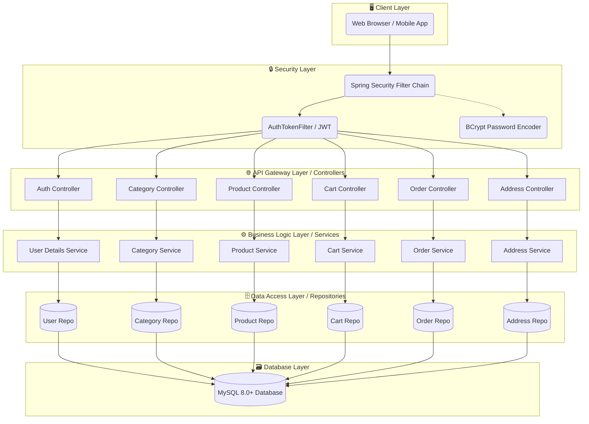

<div align="center">

# 🛒 Cartify - Backend Services E-Commerce Platform
### Enterprise-Grade Spring Boot REST API Architecture

[](#)
[](#)
[](#)
[](#)
[](#)
[](#)
[](#)

*A comprehensive, fully-featured RESTful API designed to power modern digital storefronts. Engineered with security, scalability, and clean code principles at its core, and successfully deployed to the AWS Cloud.*
</div>

---

## 📋 Table of Contents
* [Overview](#-overview)
* [Key Features & Capabilities](#-key-features--capabilities)
* [Architecture Flowchart](#-architecture-flowchart)
* [System Architecture](#-system-architecture)
* [Technology Stack](#-technology-stack)
* [Project Structure](#-project-structure)
* [Database Schema Design](#️-database-schema-design)
* [API Endpoints](#-api-endpoints)
* [Live API Showcases (Postman Proofs)](#-live-api-showcases-postman-proofs)
* [Detailed API Reference](#-detailed-api-reference)
* [Security Features](#-security-features)
* [Local Installation & Setup](#-local-installation--setup)
* [Cloud Deployment (AWS Elastic Beanstalk)](#️-cloud-deployment-aws-elastic-beanstalk)

---

## 🌟 Overview

Cartify is a comprehensive, production-ready e-commerce platform featuring complete product lifecycle management, shopping cart functionality, secure authentication, and role-based access control. Built with Spring Boot 3 and modern Java technologies, it provides a robust foundation for e-commerce operations with enterprise-grade security and scalability.

---

## ✨ Key Features & Capabilities

* **🔒 Robust Authentication:** Stateless JSON Web Token (JWT) implementation stored in secure HttpOnly cookies with strictly enforced Role-Based Access Control (RBAC). Differentiates between `ROLE_USER`, `ROLE_SELLER`, and `ROLE_ADMIN` privileges.
* **🛒 Intelligent Shopping Cart:** Dynamic state management calculating totals, validating inventory stock, updating item quantities, and ensuring data consistency upon checkout.
* **📦 Comprehensive Catalog Management:** Full CRUD operations for categories and products, featuring keyword search, image uploads, sorting, and pagination.
* **📍 Multi-Address Profiles:** Users can manage multiple shipping addresses, allowing for seamless order routing.
* **💳 Order Processing:** Transforms active cart sessions into permanent order snapshots, capturing historical pricing, discounts, and shipping details.

---

## 📂 Architecture Flowchart



---

##  🏗️ System Architecture

This application is built on a highly modular **N-Tier Architecture**, guaranteeing separation of concerns and maintainable code:

1. **Presentation Layer (Controllers):** Handles incoming HTTP requests, validates input using `@Valid`, and returns standardized `APIResponse` wrappers.
2. **Business Logic Layer (Services):** Contains all core e-commerce logic, completely decoupled from the web layer.
3. **Data Access Layer (Repositories):** Leverages **Spring Data JPA** and **Hibernate** to execute optimized SQL queries against the MySQL database.
4. **Data Transfer Object (DTO) Pattern:** Uses **ModelMapper** to enforce a strict boundary between internal database entities and external JSON payloads.

### 🛑 Global Exception Handling
A centralized `@RestControllerAdvice` (`MyGlobalExceptionHandler`) intercepts all application exceptions (e.g., `ResourceNotFoundException`, `APIException`, `MethodArgumentNotValidException`) and formats them into clean, predictable JSON responses (`APIResponse`), preventing stack traces from leaking to the client.

---

## 🛠️ Technology Stack

### Backend Technologies
* **Spring Boot 3** - Enterprise-grade application framework.
  * `spring-boot-starter-web` - RESTful API with embedded Tomcat server.
  * `spring-boot-starter-data-jpa` - ORM mapping with Hibernate.
  * `spring-boot-starter-security` - Comprehensive security framework.
  * `spring-boot-starter-validation` - Bean Validation (JSR-380).

### Security Stack
* **Spring Security 6** - Authentication and authorization framework.
* **JWT (JJWT 0.12)** - Stateless token-based authentication.
* **BCrypt** - Password hashing before database storage[cite: 1].

### Database & Utilities
* **MySQL 8.0+** - Relational database utilizing `MySQLDialect`[cite: 1].
* **Spring Data JPA** - Repository pattern implementation[cite: 1].
* **Lombok** - Reduces Java boilerplate code[cite: 1].
* **ModelMapper** - Object-to-DTO mapping[cite: 1].
* **Jackson** - JSON serialization and deserialization[cite: 1].

---

## 📂 Project Structure
```text
cartify-backend/
├── src/
│   ├── main/
│   │   ├── java/
│   │   │   └── org/
│   │   │       └── ecommerce/
│   │   │           └── sbecom/
│   │   │               ├── SbEcomApplication.java                   # Main Spring Boot Application
│   │   │               │
│   │   │               ├── config/                                  # App Configuration & Constants
│   │   │               │   ├── AppConfig.java                       # ModelMapper Bean definition
│   │   │               │   └── AppConstants.java                    # Pagination & Sorting Defaults
│   │   │               │
│   │   │               ├── controller/                              # REST API Controllers
│   │   │               │   ├── AddressController.java               # Address CRUD endpoints
│   │   │               │   ├── AuthController.java                  # Signin, Signup, Signout endpoints
│   │   │               │   ├── CartController.java                  # Cart operations endpoints
│   │   │               │   ├── CategoryController.java              # Category management endpoints
│   │   │               │   ├── OrderController.java                 # Order processing endpoints
│   │   │               │   └── ProductController.java               # Product & Image endpoints
│   │   │               │
│   │   │               ├── exceptions/                              # Global Exception Handling
│   │   │               │   ├── APIException.java                    # Custom API Exception
│   │   │               │   ├── MyGlobalExceptionHandler.java        # Centralized @RestControllerAdvice
│   │   │               │   └── ResourceNotFoundException.java       # Resource Lookup Exception
│   │   │               │
│   │   │               ├── model/                                   # JPA Database Entities
│   │   │               │   ├── Address.java                         # Address entity
│   │   │               │   ├── AppRole.java                         # Enum for user roles (USER, SELLER, ADMIN)
│   │   │               │   ├── Cart.java                            # User Cart entity
│   │   │               │   ├── CartItem.java                        # Items inside Cart entity
│   │   │               │   ├── Category.java                        # Category entity
│   │   │               │   ├── Order.java                           # Order transaction entity
│   │   │               │   ├── OrderItem.java                       # Individual ordered items snapshot
│   │   │               │   ├── Payment.java                         # Payment method & status entity
│   │   │               │   ├── Product.java                         # Product entity
│   │   │               │   ├── Role.java                            # Role entity
│   │   │               │   └── User.java                            # User entity
│   │   │               │
│   │   │               ├── payload/                                 # DTOs and Payload Wrappers
│   │   │               │   ├── AddressDTO.java
│   │   │               │   ├── APIResponse.java                     # Standard response message & status
│   │   │               │   ├── CartDTO.java
│   │   │               │   ├── CartItemDTO.java
│   │   │               │   ├── CategoryDTO.java
│   │   │               │   ├── CategoryResponse.java                # Paginated Category response wrapper
│   │   │               │   ├── OrderDTO.java
│   │   │               │   ├── OrderItemDTO.java
│   │   │               │   ├── OrderRequestDTO.java
│   │   │               │   ├── PaymentDTO.java
│   │   │               │   ├── ProductDTO.java
│   │   │               │   └── ProductResponse.java                 # Paginated Product response wrapper
│   │   │               │
│   │   │               ├── repositories/                            # Spring Data JPA Repositories
│   │   │               │   ├── AddressRepository.java
│   │   │               │   ├── CartItemRepository.java
│   │   │               │   ├── CartRepository.java
│   │   │               │   ├── CategoryRepository.java
│   │   │               │   ├── OrderItemRepository.java
│   │   │               │   ├── OrderRepository.java
│   │   │               │   ├── PaymentRepository.java
│   │   │               │   ├── ProductRepository.java
│   │   │               │   ├── RoleRepository.java
│   │   │               │   └── UserRepository.java
│   │   │               │
│   │   │               ├── security/                                # Spring Security & JWT Implementation
│   │   │               │   ├── WebSecurityConfig.java               # Security Filter Chain & RBAC rules
│   │   │               │   ├── jwt/
│   │   │               │   │   ├── AuthEntryPointJwt.java           # Unauthorized handling
│   │   │               │   │   ├── AuthTokenFilter.java             # OncePerRequest JWT Filter
│   │   │               │   │   └── JwtUtils.java                    # Token generation & validation
│   │   │               │   ├── request/
│   │   │               │   │   ├── SignupRequest.java               # Registration payload
│   │   │               │   │   └── UserInfoRequest.java             # Login payload
│   │   │               │   ├── response/
│   │   │               │   │   ├── MessageResponse.java
│   │   │               │   │   └── UserInfoResponse.java            # User details & JWT cookie response
│   │   │               │   └── services/
│   │   │                   ├── UserDetailsImpl.java                 # Custom UserDetails implementation
│   │   │                   └── UserDetailsServiceImpl.java          # UserDetailsService implementation
│   │   │               │
│   │   │               ├── service/                                 # Business Logic Interfaces & Impls
│   │   │               │   ├── AddressService.java
│   │   │               │   ├── AddressServiceImpl.java
│   │   │               │   ├── CartService.java
│   │   │               │   ├── CartServiceImpl.java
│   │   │               │   ├── CategoryService.java
│   │   │               │   ├── CategoryServiceImpl.java
│   │   │               │   ├── FileService.java                     # File upload service interface
│   │   │               │   ├── FileServiceImpl.java                 # Image upload & path resolution
│   │   │               │   ├── OrderService.java
│   │   │               │   ├── OrderServiceImpl.java
│   │   │               │   ├── ProductService.java
│   │   │               │   └── ProductServiceImpl.java
│   │   │               │
│   │   │               └── util/
│   │   │                   └── AuthUtil.java                        # Logged-in user context helper
│   │   │
│   │   └── resources/
│   │       └── application.properties                               # Main properties file
│   │
└── pom.xml                                                          # Maven dependencies

```
---

### 🗄️ Database Schema Design

The relational database is meticulously structured to ensure data integrity across the e-commerce lifecycle.

| Entity Relationship | Type | Architectural Purpose |
| :--- | :--- | :--- |
| **User ↔ Role** |  | Establishes authorization tiers for endpoint protection. |
| **User ↔ Address** |  | Maps multiple delivery locations to a single authenticated user. |
| **Category ↔ Product** |  | Organizes the inventory into a logical, hierarchical structure. |
| **User ↔ Cart** |  | Binds a unique, active shopping session to a registered user. |
| **Cart ↔ CartItem** |  | Tracks individual SKUs and aggregate quantities before checkout. |
| **Order ↔ OrderItem**|  | Immutable snapshot of cart contents generated at the time of purchase. |
| **Order ↔ Payment** |  | Associates payment metadata and gateways to a specific order. |

---

## 🌐 API Endpoints

### 🔐 Authentication Endpoints
| Method | Endpoint | Description | Auth Required |
| :--- | :--- | :--- | :--- |
| `POST` | `/api/auth/signup` | Register a new user account | Public |
| `POST` | `/api/auth/signin` | Authenticate user & set JWT Cookie | Public |
| `POST` | `/api/auth/signout` | Sign out user and clear JWT Cookie | Public |
| `GET` | `/api/auth/user` | Get current authenticated user details | 🔒 Authenticated |
| `GET` | `/api/auth/username` | Get logged-in user's username | 🔒 Authenticated |

### 📁 Category Management APIs
| Method | Endpoint | Description | Auth Required |
| :--- | :--- | :--- | :--- |
| `GET` | `/api/public/Categories` | Retrieve paginated categories | Public |
| `POST` | `/api/public/Categories` | Create a new product category | 🔒 Admin |
| `PUT` | `/api/public/Categories/{categoryId}` | Update category details | 🔒 Admin |
| `DELETE` | `/api/admin/Categories/{categoryId}` | Delete category | 🔒 Admin |

### 📦 Product Inventory APIs
| Method | Endpoint | Description | Auth Required |
| :--- | :--- | :--- | :--- |
| `GET` | `/api/public/products` | Retrieve all products (paginated/sorted) | Public |
| `GET` | `/api/public/categories/{id}/products` | Search products by category | Public |
| `GET` | `/api/public/products/keyword/{keyword}` | Search products by keyword | Public |
| `POST` | `/api/admin/categories/{id}/product` | Add product to category | 🔒 Admin / Seller |
| `PUT` | `/api/admin/products/{productId}` | Update product details | 🔒 Admin / Seller |
| `PUT` | `/api/admin/products/{productId}/image`| Upload/Update product image | 🔒 Admin / Seller |
| `DELETE` | `/api/admin/products/{productId}` | Delete product | 🔒 Admin / Seller |

### 🛒 Shopping Cart APIs
| Method | Endpoint | Description | Auth Required |
| :--- | :--- | :--- | :--- |
| `GET` | `/api/carts` | Retrieve all carts in system | 🔒 Admin |
| `GET` | `/api/carts/users/cart` | Get current active user's cart | 🔒 User |
| `POST` | `/api/carts/products/{id}/quantity/{qty}`| Add product to cart | 🔒 User |
| `PUT` | `/api/cart/products/{id}/quantity/{op}`| Update item quantity in cart | 🔒 User |
| `DELETE` | `/api/carts/{cartId}/product/{productId}`| Remove item from cart | 🔒 User |

### 📍 Address APIs
| Method | Endpoint | Description | Auth Required |
| :--- | :--- | :--- | :--- |
| `POST` | `/api/addresses` | Create shipping address | 🔒 User |
| `GET` | `/api/addresses` | Get all addresses in system | 🔒 Admin |
| `GET` | `/api/addresses/{addressId}` | Get address by ID | 🔒 User |
| `GET` | `/api/users/addresses` | Get authenticated user addresses | 🔒 User |
| `PUT` | `/api/addresses/{addressId}` | Update shipping address | 🔒 User |
| `DELETE` | `/api/addresses/{addressId}` | Delete shipping address | 🔒 User |

### 💳 Order Processing APIs
| Method | Endpoint | Description | Auth Required |
| :--- | :--- | :--- | :--- |
| `POST` | `/api/order/users/payments/{paymentMethod}`| Place order from active cart | 🔒 User |

---

## 📸 Live API Showcases (Postman Proofs)

All endpoints have been rigorously tested against the live **AWS Elastic Beanstalk** environment. Below is the visual proof of successful interactions across all major API domains.

### 1. 🔐 Security & Authentication
> **Endpoint:** `POST /api/auth/signin`
> 
> *Successfully authenticates credentials and returns the JWT required for protected routes.*
> 
> 

### 2. 📁 Category Management (Admin Operations)
> **Endpoint:** `POST /api/public/categories`
> 
> *Admin successfully creates a new product category in the system.*
> 
> 

### 3. 📦 Product Inventory
> **Endpoint:** `POST /api/admin/categories/{id}/product`
> 
> *Admin injects a new product entity mapped specifically to an existing category.*
> 
> 
> 
> **Endpoint:** `PUT /api/admin/products/{id}`
> 
> *Demonstrates successful mutation of product details.*
> 
> 

### 4. 🛒 Dynamic Shopping Cart
> **Endpoint:** `POST /api/carts/products/{id}/quantity/{qty}`
> 
> *Successfully adds a product to the authenticated user's active cart.*
> 
> 
> 
> **Endpoint:** `GET /api/carts/users/cart`
> 
> *Retrieves the aggregated cart data, including calculated totals and itemized lists.*
> 
> 

### 5. 📍 Address Profiles
> *Complete CRUD lifecycle for user shipping addresses.*
> 
> 
> 
> 
> 

### 6. 💳 Order Processing
> **Endpoint:** `POST /api/order/users/payments/{method}`
> 
> *Successfully clears the active cart and generates an immutable Order record.*
> 
> 

---

## 🌐 Detailed API Reference

### 1.1 User Registration
 
Register a new user account.
 
| Property | Value |
|----------|-------|
| **URL** | `/api/auth/signup` |
| **Method** | `POST` |
| **Auth** | None |
 
**Request Body:**
```json
{
  "username": "johndoe",
  "email": "john@example.com",
  "password": "SecurePass123!"
}
```
 
**Success Response (200 OK):**
```json
{
  "message": "User registered successfully!"
}
```
 
---
 
### 1.2 User Sign In
 
Authenticate credentials and issue a secure HttpOnly JWT Cookie.
 
| Property | Value |
|----------|-------|
| **URL** | `/api/auth/signin` |
| **Method** | `POST` |
| **Auth** | None |
 
**Request Body:**
```json
{
  "username": "johndoe",
  "password": "SecurePass123!"
}
```
 
**Success Response (200 OK):**
```json
{
  "id": 1,
  "username": "johndoe",
  "email": "john@example.com",
  "roles": ["ROLE_USER"]
}
```
 
---
 
### 1.3 Get Current Username
 
Retrieve the username of the currently authenticated user.
 
| Property | Value |
|----------|-------|
| **URL** | `/api/auth/username` |
| **Method** | `GET` |
| **Auth** | Authenticated (JWT) |
 
**Success Response (200 OK):**
```json
"johndoe"
```
 
---
 
### 1.4 Get User Details
 
Retrieve full details of the authenticated user.
 
| Property | Value |
|----------|-------|
| **URL** | `/api/auth/user` |
| **Method** | `GET` |
| **Auth** | Authenticated (JWT) |
 
**Success Response (200 OK):**
```json
{
  "id": 1,
  "username": "johndoe",
  "email": "john@example.com",
  "roles": ["ROLE_USER"]
}
```
 
---
 
### 1.5 Sign Out
 
Invalidate the user's session and clear the JWT HttpOnly cookie.
 
| Property | Value |
|----------|-------|
| **URL** | `/api/auth/signout` |
| **Method** | `POST` |
| **Auth** | Authenticated (JWT) |
 
**Success Response (200 OK):**
```json
{
  "message": "You've been signed out!"
}
```
 
---
 
## 2. 🏠 Address
 
### 2.1 Create Address
 
Add a new address for the logged-in user.
 
| Property | Value |
|----------|-------|
| **URL** | `/api/addresses` |
| **Method** | `POST` |
| **Auth** | Authenticated |
 
**Request Body:**
```json
{
  "street": "123 Main St",
  "buildingName": "Apartment 4B",
  "city": "Metropolis",
  "state": "NY",
  "country": "USA",
  "pincode": "10001"
}
```
 
**Success Response (201 Created):**
Returns the saved `AddressDTO`.
 
---
 
### 2.2 Get All Addresses
 
Retrieve all addresses (Admin use).
 
| Property | Value |
|----------|-------|
| **URL** | `/api/addresses` |
| **Method** | `GET` |
| **Auth** | Authenticated |
 
**Success Response (200 OK):**
Returns a list of `AddressDTO`.
 
---
 
### 2.3 Get Address By ID
 
Retrieve a specific address by its ID.
 
| Property | Value |
|----------|-------|
| **URL** | `/api/addresses/{addressId}` |
| **Method** | `GET` |
| **Auth** | Authenticated |
 
**Success Response (200 OK):**
Returns the `AddressDTO`.
 
---
 
### 2.4 Get User Addresses
 
Retrieve all addresses for the logged-in user.
 
| Property | Value |
|----------|-------|
| **URL** | `/api/users/addresses` |
| **Method** | `GET` |
| **Auth** | Authenticated |
 
**Success Response (200 OK):**
Returns a list of `AddressDTO`.
 
---
 
### 2.5 Update User Address
 
Update an existing address for a user.
 
| Property | Value |
|----------|-------|
| **URL** | `/api/addresses/{addressId}` |
| **Method** | `PUT` |
| **Auth** | Authenticated |
 
**Request Body:**
Updated address details.
 
**Success Response (200 OK):**
Returns the updated `AddressDTO`.
 
---
 
### 2.6 Delete User Address
 
Delete a user address by ID.
 
| Property | Value |
|----------|-------|
| **URL** | `/api/addresses/{addressId}` |
| **Method** | `DELETE` |
| **Auth** | Authenticated |
 
**Success Response (200 OK):**
Returns a status string.
 
---
 
## 3. 🛒 Cart
 
### 3.1 Add Product to Cart
 
Adds a specified quantity of a product to the cart.
 
| Property | Value |
|----------|-------|
| **URL** | `/api/carts/products/{productId}/quantity/{quantity}` |
| **Method** | `POST` |
| **Auth** | Authenticated |
 
**Success Response (201 Created):**
Returns the `CartDTO`.
 
---
 
### 3.2 Get All Carts
 
Retrieves a list of all carts.
 
| Property | Value |
|----------|-------|
| **URL** | `/api/carts` |
| **Method** | `GET` |
| **Auth** | Authenticated |
 
**Success Response (302 Found):**
Returns a list of `CartDTO`.
 
---
 
### 3.3 Get User Cart
 
Retrieves the cart for the logged-in user.
 
| Property | Value |
|----------|-------|
| **URL** | `/api/carts/users/cart` |
| **Method** | `GET` |
| **Auth** | Authenticated |
 
**Success Response (302 Found):**
Returns the `CartDTO`.
 
---
 
### 3.4 Update Cart Product Quantity
 
Update the quantity of a specific product in the cart.
 
| Property | Value |
|----------|-------|
| **URL** | `/api/cart/products/{productId}/quantity/{operation}` |
| **Method** | `PUT` |
| **Auth** | Authenticated |
 
**Path Variable:**
- `operation` – can be used to increment or adjust the quantity.
**Success Response (200 OK):**
Returns the `CartDTO`.
 
---
 
### 3.5 Delete Product From Cart
 
Removes a specific product from a cart.
 
| Property | Value |
|----------|-------|
| **URL** | `/api/carts/{cartId}/product/{productId}` |
| **Method** | `DELETE` |
| **Auth** | Authenticated |
 
**Success Response (200 OK):**
Returns a status string.
 
---
 
## 4. 🗂️ Category
 
### 4.1 Get All Categories
 
Retrieve a paginated list of all categories.
 
| Property | Value |
|----------|-------|
| **URL** | `/api/public/Categories` |
| **Method** | `GET` |
| **Auth** | Public |
 
**Query Parameters:**
`pageNumber`, `pageSize`, `sortBy`, `sortOrder`
 
**Success Response (200 OK):**
Returns `CategoryResponse`.
 
---
 
### 4.2 Create Category
 
Add a new product category.
 
| Property | Value |
|----------|-------|
| **URL** | `/api/public/Categories` |
| **Method** | `POST` |
| **Auth** | Public / Admin |
 
**Request Body:**
```json
{
  "categoryName": "Electronics"
}
```
 
**Success Response (201 Created):**
Returns the saved `CategoryDTO`.
 
---
 
### 4.3 Update Category
 
Update an existing category.
 
| Property | Value |
|----------|-------|
| **URL** | `/api/public/Categories/{categoryId}` |
| **Method** | `PUT` |
| **Auth** | Public / Admin |
 
**Request Body:**
`CategoryDTO`
 
**Success Response (200 OK):**
Returns the updated `CategoryDTO`.
 
---
 
### 4.4 Delete Category
 
Remove a category by its ID.
 
| Property | Value |
|----------|-------|
| **URL** | `/api/admin/Categories/{categoryId}` |
| **Method** | `DELETE` |
| **Auth** | Admin |
 
**Success Response (200 OK):**
Returns the deleted `CategoryDTO`.
 
---
 
## 5. 📦 Order
 
### 5.1 Place Order
 
Checkout and place an order for items in the user's cart.
 
| Property | Value |
|----------|-------|
| **URL** | `/api/order/users/payments/{paymentMethod}` |
| **Method** | `POST` |
| **Auth** | Authenticated |
 
**Request Body:**
```json
{
  "addressId": 1,
  "pgName": "Stripe",
  "pgPaymentId": "pay_12345",
  "pgStatus": "SUCCESS",
  "pgResponseMessage": "Payment completed"
}
```
 
**Success Response (201 Created):**
Returns the `OrderDTO`.
 
---
 
## 6. 📱 Product
 
### 6.1 Add Product
 
Add a new product to a specific category.
 
| Property | Value |
|----------|-------|
| **URL** | `/api/admin/categories/{categoryId}/product` |
| **Method** | `POST` |
| **Auth** | Admin |
 
**Request Body:**
```json
{
  "productName": "Smartphone X",
  "description": "Latest model smartphone",
  "price": 999.99,
  "quantity": 50,
  "discount": 10.0
}
```
 
**Success Response (201 Created):**
Returns the saved `ProductDTO`.
 
---
 
### 6.2 Get All Products
 
Retrieve a paginated list of all products.
 
| Property | Value |
|----------|-------|
| **URL** | `/api/public/products` |
| **Method** | `GET` |
| **Auth** | Public |
 
**Query Parameters:**
`pageNumber`, `pageSize`, `sortBy`, `sortOrder`
 
**Success Response (200 OK):**
Returns `ProductResponse`.
 
---
 
### 6.3 Get Products By Category
 
Retrieve a paginated list of products under a specific category.
 
| Property | Value |
|----------|-------|
| **URL** | `/api/public/categories/{categoryId}/products` |
| **Method** | `GET` |
| **Auth** | Public |
 
**Query Parameters:**
`pageNumber`, `pageSize`, `sortBy`, `sortOrder`
 
**Success Response (200 OK):**
Returns `ProductResponse`.
 
---
 
### 6.4 Search Products By Keyword
 
Search for products using a keyword.
 
| Property | Value |
|----------|-------|
| **URL** | `/api/public/products/keyword/{keyword}` |
| **Method** | `GET` |
| **Auth** | Public |
 
**Query Parameters:**
`pageNumber`, `pageSize`, `sortBy`, `sortOrder`
 
**Success Response (302 Found):**
Returns `ProductResponse`.
 
---
 
### 6.5 Update Product
 
Update details of an existing product.
 
| Property | Value |
|----------|-------|
| **URL** | `/api/admin/products/{productId}` |
| **Method** | `PUT` |
| **Auth** | Admin |
 
**Request Body:**
`ProductDTO`
 
**Success Response (200 OK):**
Returns the updated `ProductDTO`.
 
---
 
### 6.6 Delete Product
 
Delete a product by its ID.
 
| Property | Value |
|----------|-------|
| **URL** | `/api/admin/products/{productId}` |
| **Method** | `DELETE` |
| **Auth** | Admin |
 
**Success Response (200 OK):**
Returns the deleted `ProductDTO`.
 
---
 
### 6.7 Update Product Image
 
Upload or update a product's image.
 
| Property | Value |
|----------|-------|
| **URL** | `/api/admin/products/{productId}/image` |
| **Method** | `PUT` |
| **Auth** | Admin |
| **Consumes** | `multipart/form-data` |
 
**Request Body:**
`image` (Multipart File)
 
**Success Response (200 OK):**
Returns the `ProductDTO`.
 
---

## 🛡️ Security Features

### Authentication & Authorization
* **JWT Tokens:** Generated with HMAC-SHA secret keys (`spring.app.jwtSecret`) for verifying identity[cite: 1].
* **HttpOnly Cookies:** Tokens are encapsulated within secure HttpOnly cookies (`SpringBootEcom`), shielding tokens from XSS (Cross-Site Scripting) vulnerabilities[cite: 1].
* **BCrypt Hashing:** Passwords are fully encrypted via `BCryptPasswordEncoder` prior to storage[cite: 1].
* **Role-Based Access Control (RBAC):** Strictly protects routes based on user authorities (`ROLE_USER`, `ROLE_SELLER`, `ROLE_ADMIN`)[cite: 1].

### API & Data Security
* **Input Validation:** Enforces strict Bean Validation (JSR-380) annotations `@Valid`, `@NotBlank`, `@Email`, and `@Size` on incoming DTO payloads[cite: 1].
* **Business Logic Safeguards:** Validates stock quantities before permitting cart addition or quantity changes, preventing negative inventory or over-ordering[cite: 1].
* **File Upload Protections:** Resolves file upload paths dynamically using structured directories while renaming files with UUIDs to prevent directory traversal and overwrite attacks[cite: 1].

---

## 💻 Local Installation & Setup

### 1. Prerequisites
Ensure you have the following installed on your local machine:
* **Java Development Kit (JDK) 21**
* **Maven 3.x**
* **MySQL Server** (Running on default port `3306`)

### 2. Initialization

**Clone the repository:**
```bash
git clone [https://github.com/Shumaim-quratulain/sb-ecom.git](https://github.com/Shumaim-quratulain/sb-ecom.git)
cd sb-ecom
```

**Configure the Database:**
This project utilizes environment variables to protect sensitive credentials. You must provide these variables to your IDE's Run Configuration or terminal environment before starting the application:

```text
DB_URL=jdbc:mysql://localhost:3306/ecommerce_db?createDatabaseIfNotExist=true
DB_USERNAME=your_local_mysql_user
DB_PASSWORD=your_local_mysql_password
JWT_SECRET=your_generated_secret_key
```

**Build and Run (via Terminal):**
```bash
mvn clean install
mvn spring-boot:run
```

---

## ☁️ Cloud Deployment (AWS Elastic Beanstalk)

This API was containerized and deployed to **AWS Elastic Beanstalk** using a Corretto 21 environment running on Amazon Linux 2023. 

**Security & Environment Configuration:**
*   Connected to a highly available **Amazon RDS MySQL** database.
*   Sensitive data (Database URLs, Passwords, and JWT Secrets) are strictly isolated from the source code. They are injected at runtime via Elastic Beanstalk **Environment Properties**.
*   Configured with `SERVER_PORT=5000` to properly map the EC2 Nginx reverse proxy to the internal Spring Boot Tomcat server.


---
<div align="center">
  <b>Architected and Developed by Shumaim Quratulain</b><br>
  <a href="https://github.com/Shumaim-quratulain">View GitHub Profile</a>
</div>


